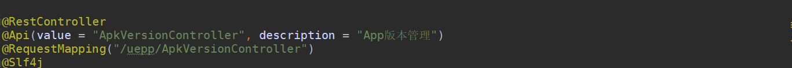
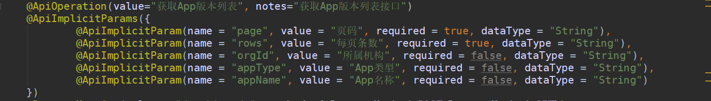
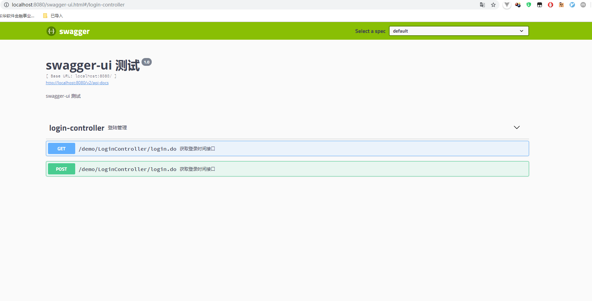
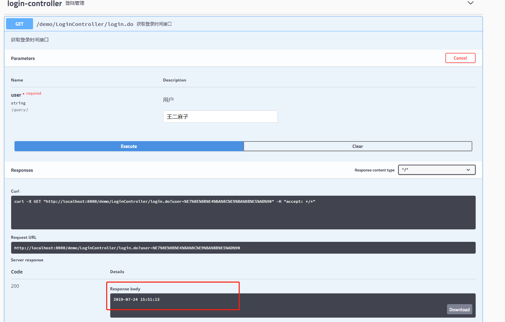

# springboot-swaggerui
我只是想搞一搞springboot和swaggerui
# Swagger-ui
>今天在看一只新项目的时候发现酱样

还有酱样


这都是啥，好奇心溢出……


## Swagger– The World's Most Popular Framework for APIs
### Swagger由来和优势
> 现在多数的项目开发中，网站和移动端都需要进行数据交互和对接，这少不了使用REST编写API接口这种场景。 特别是不同开发小组协作时，就更需要以规范和文档作为标准和协作基础。良好的文档可以减少沟通成本，达到事半功倍的效果。
有时对一些API说明的理解比较模糊，总想着能直接验证一下自己的理解就好了，而不是需要去项目写测试代码来验证自己的想法。 即API文档应具备直接执行能力，这种能力类似word,wiki等是无法提供。 SwaggerUI就是这样一种利器，基于html+javascript实现，倾向于在线文档和测试，使用和集成十分简单，能容易地生成不同模块下的API列表， 每个API接口描述和参数、请求方法都能定制并直接测试得到直观的响应数据。

### Swagger缺点
>如果是与服务端代码集成，直接嵌入到工程代码中，侵入性比较大，将文档参数和应用参数杂糅在一起，不易阅读，而且比较依赖于项目， 无法独立部署，项目挂掉，文档也无法访问。给后期代码维护增加难度。
如果直接编辑json文档，则难度比较大，即使是官网的在线编辑功能也比较弱，提示功能差劲，很多时候在编辑预览中没问题，导出来部署就显示不正常，而且 不支持多人编辑，只能一次一个人改，部署相当不方便。
用户体验无论请求还是响应无法方便的输入自定义json格式，特别是多层嵌套，异常繁琐。

### Swagger常用注解使用工具箱
>@Api：用在类上，说明该类的作用。
@ApiOperation：注解来给API增加方法说明。
@ApiImplicitParams : 用在方法上包含一组参数说明。
@ApiImplicitParam：用来注解来给方法入参增加说明。
@ApiResponses：用于表示一组响应
@ApiResponse：用在@ApiResponses中，一般用于表达一个错误的响应信息
    code：数字，例如400
    message：信息，例如"请求参数没填好"
    response：抛出异常的类   
@ApiModel：描述一个Model的信息（一般用在请求参数无法使用@ApiImplicitParam注解进行描述的时候）
     @ApiModelProperty：描述一个model的属性

## 撸它
>创建项目就跳过了，文末提供git地址。添加如下项目中必要依赖：

```
<dependency>
            <groupId>org.springframework.boot</groupId>
            <artifactId>spring-boot-starter-web</artifactId>
        </dependency>
        <dependency>
            <groupId>org.mybatis.spring.boot</groupId>
            <artifactId>mybatis-spring-boot-starter</artifactId>
            <version>2.1.0</version>
        </dependency>

        <dependency>
            <groupId>mysql</groupId>
            <artifactId>mysql-connector-java</artifactId>
            <scope>runtime</scope>
        </dependency>
        <dependency>
            <groupId>org.springframework.boot</groupId>
            <artifactId>spring-boot-starter-test</artifactId>
            <scope>test</scope>
        </dependency>
        <dependency>
            <groupId>org.springframework.security</groupId>
            <artifactId>spring-security-test</artifactId>
            <scope>test</scope>
        </dependency>
        <dependency>
            <groupId>io.springfox</groupId>
            <artifactId>springfox-swagger2</artifactId>
            <version>2.9.2</version>
        </dependency>

        <dependency>
            <groupId>io.springfox</groupId>
            <artifactId>springfox-swagger-ui</artifactId>
            <version>2.9.2</version>
        </dependency>
        <dependency>
            <groupId>org.projectlombok</groupId>
            <artifactId>lombok</artifactId>
            <version>1.18.4</version>
        </dependency>
        <dependency>
            <groupId>com.alibaba</groupId>
            <artifactId>druid</artifactId>
            <version>1.0.24</version>
        </dependency>
        <dependency>
            <groupId>com.alibaba</groupId>
            <artifactId>fastjson</artifactId>
            <version>1.2.31</version>
        </dependency>
```
>创建swagger配置类

```
@Configuration
public class SwaggerConfig {
    @Bean
    public Docket createRestApi() {
        return new Docket(DocumentationType.SWAGGER_2)
                .apiInfo(apiInfo())
                .select()
                .apis(RequestHandlerSelectors.basePackage("com.scg.springbootswaggerui.controller")) //添加需生成文档类所在包路径
                .paths(PathSelectors.any())
                .build();
    }
    private ApiInfo apiInfo() {
        return new ApiInfoBuilder()
                .title("swagger-ui 测试")		//文档标题
                .description("swagger-ui 测试")	//文档描述
                .version("1.0")
                .build();
    }
}
```


>配置applicatin.yml文件，文件放置在resources文件夹下

```
server:
  port: 8080

spring:
  datasource:
    driver-class-name: com.mysql.jdbc.Driver
    url: jdbc:mysql://localhost:3306/test?useUnicode=true&characterEncoding=UTF-8&useSSL=false	#数据库链接填写自己的
    username: root		#密码和用户名填写自己的
    password: root
    type: com.alibaba.druid.pool.DruidDataSource

```
>重点来了

```
@RestController
@Api(value = "LoginController", description = "登陆管理")
@RequestMapping("/demo/LoginController")
@Slf4j
public class LoginController {
    @ApiOperation(value = "获取登录时间接口", notes = "获取登录时间接口")
    @ApiImplicitParam(name = "user", value = "用户", required = true, dataType = "String",paramType="query")	//paramType="query"这个参数很重要参数值不能为path，否则请求参数后台方法接收不到
    @RequestMapping(value = "/login.do", method = { RequestMethod.POST,RequestMethod.GET})
    public Object login(HttpServletRequest request){
        log.info("打印所有参数："+JSON.toJSONString(request.getParameterMap()));
        log.info("登陆用户为："+request.getParameter("user"));
        return new SimpleDateFormat("yyyy-MM-dd HH:mm:ss").format(new Date());
    }
}
```

>启动项目的之后输入http://localhost:8080/swagger-ui.html即可访问你的api文档啦！

>可以当做postman来用，填入必要参数访问后台哦~


##总结：
>Swagger-ui优劣参半，好处多多，动态维护文档，方便自己，方便他人使用；缺点就是侵入性

>Git地址https://github.com/cat-fishing/springboot-swaggerui.git

